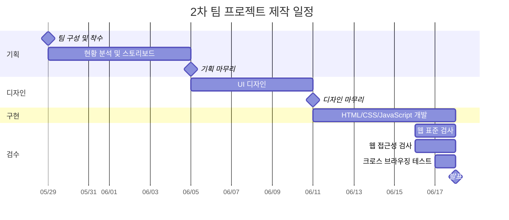

# ROUNZ Renewal

> [이스트캠프] 오르미 프론트엔드 개발 13기 2차 팀 프로젝트를 기반으로  
> Vanilla JavaScript와 Tailwind CSS를 활용해 UI/UX와 코드 구조를 개인적으로 리뉴얼한 프로젝트입니다.

[](https://vite.dev)
[](https://developer.mozilla.org/ko/docs/Web/JavaScript)
[](https://tailwindcss.com)
[](https://swiperjs.com)
[](https://biomejs.dev)
[](https://vercel.com)
[](./LICENSE)

## 배포

- 개인 리뉴얼 배포: https://estfe132ndprojectpersonal.vercel.app/
- 개인 리뉴얼 Repository: https://github.com/RaeChoe/ESTFE13_2nd_Project_personal
- 원본 팀 프로젝트 Repository: https://github.com/agw76638/est_fe13_2nd_project

---

## 프로젝트 소개

ROUNZ 홈페이지의 UI/UX를 참고하여 제작한 아이웨어 쇼핑몰 프로젝트입니다.

초기 프로젝트는 이스트캠프 오르미 프론트엔드 개발 13기 과정에서
5명이 함께 진행한 팀 프로젝트로,
HTML, CSS, Vanilla JavaScript를 활용하여
메인 페이지, 상품 목록, 상품 상세, 장바구니,
로그인 및 회원가입 페이지를 구현했습니다.

이후 개인 포트폴리오 프로젝트로 발전시키기 위해
기존 기능과 JSON 기반 데이터 구조는 유지하면서
전체 UI/UX와 코드 구조를 다시 설계했습니다.

개인 리뉴얼에서는 특정 페이지에 한정하지 않고
공통 Header / Footer부터 메인, 상품 목록, 상품 상세,
장바구니, 로그인 / 회원가입, 404 페이지까지
전체 화면을 새로운 디자인 시스템으로 통일했습니다.

---

## 개인 리뉴얼 목표

기존 팀 프로젝트를 단순히 디자인만 변경하는 것이 아니라,
다음과 같은 목표를 중심으로 개선했습니다.

- 기존 Vanilla JavaScript 기반 기능 유지
- Tailwind CSS v4를 활용한 스타일 구조 개선
- 페이지별로 달랐던 디자인을 하나의 UI 시스템으로 통일
- 데스크톱 중심 화면을 모바일 / 태블릿까지 반응형으로 개선
- 공통 Header / Footer의 재사용성과 인터랙션 강화
- JSON 기반 상품 및 후기 데이터 활용 확대
- 장바구니 및 상품 상세 UX 개선
- 키보드 사용자를 고려한 접근성 개선
- 사용하지 않는 CSS 및 JavaScript 코드 제거
- Biome를 활용한 코드 품질 관리

---

## 원본 프로젝트와 개인 리뉴얼 비교

| 항목 | 원본 팀 프로젝트 | 개인 리뉴얼 |
| --- | --- | --- |
| 스타일링 | Custom CSS 중심 | Tailwind CSS v4 중심 |
| CSS 구조 | reset / variables / utilities / modules / pages | `style.css` + 최소 페이지 CSS |
| CSS Reset | modern-normalize + custom reset | Tailwind Preflight |
| 공통 Header | 기본 내비게이션 | Fixed Header, Dropdown, Mobile Drawer |
| Footer | 기본 정보 영역 | 브랜드 / Shop / Support 구조로 재설계 |
| 메인 페이지 | Hero, 탭, 추천 상품 중심 | Editorial 스타일 Hero, 카테고리, 추천 상품, Support 영역 |
| 슬라이더 | Swiper 기본 설정 | Swiper 12 + Autoplay / Navigation / Pagination |
| 상품 목록 | 기본 필터 및 상품 카드 | 검색 / 필터 / 정렬 / 배지 / 반응형 카드 UI 개선 |
| 상품 상세 | 기본 상품 정보 중심 | 구매 정보, 후기, 문의, 구매정보 탭 및 서비스 영역 재구성 |
| 장바구니 | 기본 목록 및 수량 변경 | 전체 선택, 선택 삭제, 주문 요약, 추천 상품 UI 개선 |
| 로그인 / 회원가입 | 기본 입력 폼 | 공통 Auth UI 및 비밀번호 표시 기능 개선 |
| 후기 데이터 | 12개 | 113개 |
| 반응형 | 일부 적용 | 모바일 / 태블릿 / 데스크톱 전반 대응 |
| 접근성 | 기본 마크업 | Skip Link, aria 속성, 키보드 제어, inert 등 강화 |
| 코드 품질 | Biome 기본 설정 | lint / format / check scripts 추가 |
| 배포 | 팀 프로젝트 배포 | Vercel 개인 배포 |

---

## 주요 기능

### 1. 공통 Header / Footer

- 모든 페이지에서 JavaScript 모듈을 통한 공통 렌더링
- Fixed Header 적용
- Collection Dropdown 메뉴
- NEW / BEST 상품 바로가기
- Editorial / Guide 섹션 이동
- 장바구니 상품 수 실시간 표시
- 모바일 전용 Drawer Menu
- 모바일 Collection Accordion
- 메뉴 외부 클릭 및 ESC 키를 통한 닫기
- 메뉴 종료 후 이전 Focus 복원
- 모바일 메뉴 활성화 시 본문 `inert` 처리
- 키보드 사용자를 위한 `본문 바로가기` 제공

### 2. 메인 페이지

- Swiper 기반 Hero Slider
- 자동 재생, 좌우 Navigation 및 Pagination 적용
- 상품 데이터를 활용한 카테고리 이미지 구성
- 카테고리별 상품을 조합한 Featured Products
- 공지사항 / 이벤트 / FAQ JSON 데이터 렌더링
- 후기 데이터를 활용한 Review 콘텐츠
- 반응형 Editorial 스타일 레이아웃

### 3. 상품 목록

- JSON 상품 데이터 기반 동적 렌더링
- 전체 상품 / 안경 / 선글라스 / 렌즈 / 액세서리 카테고리 지원
- NEW / BEST 배지 필터
- 검색 기능
- 상품 필터링
- 정렬 기능
- 상품 카드 배지 표시
- 상품 상세 페이지 연결
- 화면 크기에 따른 반응형 Grid 구성

### 4. 상품 상세

- URL Query Parameter를 이용한 상품 조회

```text
/detail.html?id=상품ID
```

- 상품 이미지 및 기본 정보 렌더링
- 상품 가격 및 할인 정보 표시
- 수량 선택
- 장바구니 추가
- LocalStorage 장바구니 연동
- 상세정보 / 후기 / 문의 / 구매정보 Tab 구성
- 키보드 방향키를 이용한 Tab 이동
- JSON 후기 데이터 동적 렌더링
- 상품별 후기 데이터 확장
- 프리미엄 서비스 및 구매 안내 영역 구성

### 5. 장바구니

- LocalStorage 기반 장바구니 저장
- 상품별 수량 변경
- 개별 상품 선택
- 전체 상품 선택
- 선택 상품 삭제
- 상품별 금액 계산
- 선택 상품 기준 주문 금액 계산
- 빈 장바구니 상태 처리
- 현재 장바구니 상품을 제외한 추천 상품 제공
- NEW / BEST 상품 우선 추천
- 데스크톱 Sticky 주문 요약 영역
- 모바일 환경에서 주문 요약 영역 하단 배치

### 6. 로그인 / 회원가입

실제 Backend 인증을 연결하지 않은
프론트엔드 UI 및 Validation 데모 기능입니다.

#### 로그인

- 이메일 형식 검사
- 이메일 / 비밀번호 필수 입력 검사
- 비밀번호 표시 / 숨김
- 네이버 / 카카오 소셜 로그인 UI

#### 회원가입

- 이름 / 이메일 / 비밀번호 입력 검사
- 이메일 형식 검사
- 비밀번호 8자 이상 검사
- 비밀번호 확인 일치 검사
- 비밀번호 표시 / 숨김
- 네이버 / 카카오 회원가입 UI

### 7. 404

- 기존 Legacy CSS를 제거하고 Tailwind CSS 기반으로 재구성
- 홈 이동
- 상품 목록 이동
- 공통 Header / Footer 적용
- 반응형 오류 안내 UI

---

## 접근성 개선

개인 리뉴얼 과정에서 마우스 사용뿐만 아니라
키보드 사용자도 주요 기능을 이용할 수 있도록 개선했습니다.

- `main` 영역에 `id="content"` 지정
- `본문 바로가기` Skip Link 제공
- 아이콘 버튼에 `aria-label` 제공
- 장식용 SVG에 `aria-hidden="true"` 적용
- Dropdown / Accordion에 `aria-expanded` 사용
- 메뉴 상태에 `aria-hidden` 적용
- 모바일 메뉴 활성화 시 `inert`를 이용해 배경 콘텐츠 접근 제한
- ESC 키를 이용한 메뉴 닫기 지원
- 모바일 메뉴 종료 후 기존 Focus 위치 복원
- 상품 상세 Tab 키보드 조작 지원
- 화면에 표시하지 않는 텍스트는 Tailwind `sr-only` 사용

---

## 스타일 리팩토링

### 기존

초기 프로젝트에서는 다음과 같이
여러 Global CSS와 Utility 파일을 조합하여 사용했습니다.

```text
css/
├── base/
│   ├── reset.css
│   ├── variables.css
│   └── utilities.css
├── modules/
│   ├── header.css
│   └── footer.css
├── pages/
├── login.css
├── signup.css
└── style.css
```

### 리뉴얼

Tailwind CSS v4 도입 후
중복되거나 사용하지 않는 Legacy CSS를 제거하고
페이지별로 반드시 필요한 스타일만 남겼습니다.

```text
css/
├── pages/
│   ├── auth.css
│   ├── cart.css
│   ├── detail.css
│   ├── index.css
│   └── productList.css
└── style.css
```

`style.css`에서는 Tailwind CSS와
프로젝트 공통 Theme 및 Layout만 관리합니다.

```css
@import "tailwindcss";

@theme {
  --color-canvas: #f4f1ec;
  --color-paper: #fbfaf8;
  --color-ink: #171517;
  --color-muted: #777174;
  --color-line: #d9d4d6;

  --color-plum-700: #583a54;
}
```

---

## 기술 스택

| 분류 | 기술 |
| --- | --- |
| Markup | HTML5 |
| Language | Vanilla JavaScript ES Modules |
| Styling | Tailwind CSS v4 |
| Slider | Swiper 12 |
| Data | JSON |
| Storage | Web Storage API (`localStorage`) |
| Build | Vite 8 |
| Code Quality | Biome |
| Deployment | Vercel |

### 주요 패키지

```json
{
  "dependencies": {
    "@tailwindcss/vite": "^4.3.3",
    "swiper": "^12.2.0",
    "tailwindcss": "^4.3.3"
  },
  "devDependencies": {
    "@biomejs/biome": "^2.4.16",
    "vite": "^8.0.12"
  }
}
```

---

## Vite Multi Page 구성

SPA가 아닌 여러 HTML 페이지로 구성된 프로젝트이므로
Vite의 Multi Page Build 설정을 사용했습니다.

```js
build: {
  rolldownOptions: {
    input: {
      main: resolve(__dirname, "index.html"),
      notFound: resolve(__dirname, "404.html"),
      productList: resolve(__dirname, "productList.html"),
      detail: resolve(__dirname, "detail.html"),
      cart: resolve(__dirname, "cart.html"),
      login: resolve(__dirname, "login.html"),
      signup: resolve(__dirname, "signup.html"),
    },
  },
}
```

---

## 프로젝트 구조

```text
.
├── data/
│   ├── event.json
│   ├── faq.json
│   ├── notice.json
│   ├── products.json
│   └── reviews.json
│
├── public/
│   └── images/
│
├── src/
│   ├── assets/
│   │   └── brand/
│   │       ├── logo_kakao.svg
│   │       ├── logo_naver.svg
│   │       └── logo_rounz.png
│   │
│   ├── css/
│   │   ├── pages/
│   │   │   ├── auth.css
│   │   │   ├── cart.css
│   │   │   ├── detail.css
│   │   │   ├── index.css
│   │   │   └── productList.css
│   │   └── style.css
│   │
│   └── js/
│       ├── modules/
│       │   ├── categoryLink.js
│       │   ├── footer.js
│       │   ├── header.js
│       │   └── tabs.js
│       │
│       ├── pages/
│       │   ├── 404.js
│       │   ├── cart.js
│       │   ├── detail.js
│       │   ├── index.js
│       │   ├── login.js
│       │   ├── productList.js
│       │   └── signup.js
│       │
│       └── utils/
│           └── common.js
│
├── 404.html
├── cart.html
├── detail.html
├── index.html
├── login.html
├── productList.html
├── signup.html
├── biome.json
├── package.json
└── vite.config.js
```

---

## 데이터 구성

상품, 후기, 공지, 이벤트, FAQ 데이터는
별도의 JSON 파일로 관리합니다.

| 데이터 | 용도 |
| --- | --- |
| `products.json` | 상품 목록 및 상세 정보 |
| `reviews.json` | 상품 후기 |
| `notice.json` | 공지사항 |
| `event.json` | 이벤트 |
| `faq.json` | FAQ |

개인 리뉴얼 과정에서 상품별 후기 표현을 보강하기 위해
후기 데이터를 기존 12개에서 113개로 확장했습니다.

---

## 코드 품질

Biome를 이용하여
Format과 Lint를 함께 관리합니다.

```bash
npm run lint
npm run format
npm run check
```

```json
{
  "scripts": {
    "dev": "vite",
    "build": "vite build",
    "preview": "vite preview",
    "lint": "biome lint .",
    "format": "biome format --write .",
    "check": "biome check ."
  }
}
```

최종 리뉴얼 이후 `npm run check`와
`npm run build`를 통해 코드 및 빌드 상태를 확인했습니다.

---

## 팀 프로젝트

### 제작 기간

2026.05.29 ~ 2026.06.18



### 팀원 및 담당

| 이름 | 역할 | 주요 담당 | GitHub |
| --- | --- | --- | --- |
| 안건욱 | 팀장 | 메인 페이지, 공통 요소 | [agw76638](https://github.com/agw76638) |
| 송주윤 | 팀원 | 장바구니 페이지 | [Polao63](https://github.com/Polao63) |
| 장진혁 | 팀원 | 상품 목록 페이지 | [wwg98](https://github.com/wwg98) |
| **최정원** | 팀원 | **회의록 정리, 상품 상세 페이지** | [RaeChoe](https://github.com/RaeChoe) |
| 최이리나 | 팀원 | 로그인 / 회원가입 페이지 | [tsoyirina48-ai](https://github.com/tsoyirina48-ai) |

---

## 개인 리뉴얼

원본 팀 프로젝트 종료 후
최정원이 개인 포트폴리오 프로젝트로 전체 화면을 리뉴얼했습니다.

### 리뉴얼 범위

```text
1. 공통 Header / Footer 리뉴얼
2. 메인 페이지 리뉴얼
3. 상품 목록 페이지 리뉴얼
4. 상품 상세 페이지 리뉴얼
5. 장바구니 페이지 리뉴얼
6. 로그인 / 회원가입 페이지 리뉴얼
7. Legacy CSS 및 불필요 코드 정리
8. 반응형 / 접근성 / 빌드 최종 점검
```

팀 프로젝트 당시에는 상품 상세 페이지를 담당했지만,
개인 리뉴얼에서는 기존 팀원이 구현했던 영역을 포함하여
프로젝트 전체의 UI/UX 및 프론트엔드 구조를 직접 재설계했습니다.

---

## 시작하기

```bash
git clone https://github.com/RaeChoe/ESTFE13_2nd_Project_personal.git

cd ESTFE13_2nd_Project_personal

npm install

npm run dev
```

개발 서버 실행 후 Vite에서 안내하는 주소로 접속합니다.

---

## Build

```bash
npm run build
```

빌드 결과는 `dist/` 디렉터리에 생성됩니다.

로컬에서 빌드 결과를 확인하려면:

```bash
npm run preview
```

---

## License

이 프로젝트는 MIT License를 따릅니다.

ROUNZ의 브랜드명 및 디자인 요소는
학습 목적의 프로젝트에서 참고 목적으로 사용되었습니다.
